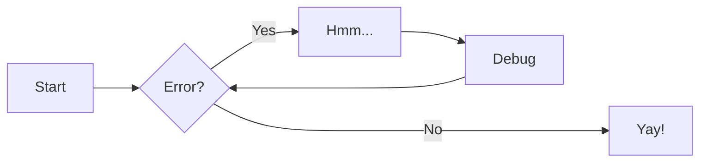

# sage-periods: A SageMath Package to Compute Rational Diagonals and Periods 

This package computes annihilating linear differential equations for diagonals of rational functions and period integrals of rational functions with a single parameter.

Our methods are based on the [MAGMA period package](https://github.com/lairez/periods) of [Pierre Lairez](https://mathexp.eu/lairez/) which implements the algorithm described in the paper *[Computing Periods of Rational Integrals](https://www.ams.org/journals/mcom/2016-85-300/S0025-5718-2015-03054-3/)*, and integrate with the [sage-acsv](https://github.com/ACSVMath/sage_acsv) and [ore-algebra](https://github.com/mkauers/ore_algebra/) SageMath packages.

Most users will need only the functions:

- [`compute_diagonal_annihilator`](reference/#sage_periods.picard_fuchs.compute_diagonal_annihilator) - Takes a symbolic rational function $F(x_1,\dots,x_d)$ and a *direction vector* $\mathbf{r}\in\mathbb{N}^d$ and computes an operator representing a linear ODE with polynomial coefficients annihilating the *$\mathbf{r}$-diagonal* $S(t) = \sum_{n \geq 0}f_{n\mathbf{r}}t^n$ defined by the coefficients $f_{\mathbf{i}}$ of *any* convergent Laurent expansion of $F$. By default the *main diagonal* $\mathbf{r}=\mathbf{1}$ is chosen.

- [`compute_period_annihilator`](reference/#sage_periods.picard_fuchs.compute_period_annihilator) - Takes a symbolic rational function $R(x_1,\dots,x_d,t)$ and computes an operator representing a linear ODE with polynomial coefficients annihilating all *period integrals* $P(t) = \int_\Gamma R(\mathbf{x},t) d\mathbf{x}$ for suitable closed chains of integration $\Gamma$.  

All public facing functions and classes in our package are documented in our [reference manual](reference.md).

## Quickstart

To use the package, simply download the source code from the [GitHub repository](https://github.com/ACSVMath/sage_periods), then import the commands from the package.

```

from sage_periods import compute_diagonal_annihilator

``` 

!!! warning
   
      Make sure you're running SageMath from the same directory where the source code folder is located.

<!-- TODO: Add to Pip. Once we're ready for the 0.1.0 version + have workflows set up for this. -->
<!-- The easiest way to install the latest released version of the package
is via PyPI simply by running

```
sage -pip install sage-periods
```
or, alternatively, executing a cell containing
```
%pip install sage-periods
```
in a SageMath Jupyter notebook. -->

## Examples

After importing `compute_diagonal_annihilator` as above, one can run
```

sage: var('x y')
sage: F = 1/(1-x-y)
sage: compute_diagonal_annihilator(F)
(t - 1/4)*Dt + 1/2

``` 
to show that the main diagonal 

$$ S(t) = \sum_{n \geq 0}\binom{2n}{n} = (1-4t)^{-1/2}$$ 

of $1/(1-x-y)$ satisfies $(t-1/4)S'(t) + (1/2)S(t) = 0$.

Further examples can be found in the documentation for each function.

<!-- ================ From "index.md" ================= -->
<!-- ## Bibliography

TODO: 

Here is an in-text citation [@einstein1935].

Here is the reference:

@einstein1935
        
## Examples

### Admonitions

> Go to [documentation](https://zensical.org/docs/authoring/admonitions/)

!!! note

    This is a **note** admonition. Use it to provide helpful information.

!!! warning

    This is a **warning** admonition. Be careful!

### Details

> Go to [documentation](https://zensical.org/docs/authoring/admonitions/#collapsible-blocks)

??? info "Click to expand for more info"

    This content is hidden until you click to expand it.
    Great for FAQs or long explanations.

## Code Blocks

> Go to [documentation](https://zensical.org/docs/authoring/code-blocks/)

``` python hl_lines="2" title="Code blocks"
def greet(name):
    print(f"Hello, {name}!") # (1)!

greet("Python")
```

1.  > Go to [documentation](https://zensical.org/docs/authoring/code-blocks/#code-annotations)

    Code annotations allow to attach notes to lines of code.

Code can also be highlighted inline: `#!python print("Hello, Python!")`.

## Content tabs

> Go to [documentation](https://zensical.org/docs/authoring/content-tabs/)

=== "Python"

    ``` python
    print("Hello from Python!")
    ```

=== "Rust"

    ``` rs
    println!("Hello from Rust!");
    ```

## Diagrams

> Go to [documentation](https://zensical.org/docs/authoring/diagrams/)



## Footnotes

> Go to [documentation](https://zensical.org/docs/authoring/footnotes/)

Here's a sentence with a footnote.[^1]

Hover it, to see a tooltip.

[^1]: This is the footnote.


## Formatting

> Go to [documentation](https://zensical.org/docs/authoring/formatting/)

- ==This was marked (highlight)==
- ^^This was inserted (underline)^^
- ~~This was deleted (strikethrough)~~
- H~2~O
- A^T^A
- ++ctrl+alt+del++

## Icons, Emojis

> Go to [documentation](https://zensical.org/docs/authoring/icons-emojis/)

* :sparkles: `:sparkles:`
* :rocket: `:rocket:`
* :tada: `:tada:`
* :memo: `:memo:`
* :eyes: `:eyes:`

## Maths

> Go to [documentation](https://zensical.org/docs/authoring/math/)

$$
\cos x=\sum_{k=0}^{\infty}\frac{(-1)^k}{(2k)!}x^{2k}
$$

!!! warning "Needs configuration"
    Note that MathJax is included via a `script` tag on this page and is not
    configured in the generated default configuration to avoid including it
    in a pages that do not need it. See the documentation for details on how
    to configure it on all your pages if they are more Maths-heavy than these
    simple starter pages.

<script id="MathJax-script" src="https://unpkg.com/mathjax@3/es5/tex-mml-chtml.js"></script>
<script>
  window.MathJax = {
    tex: {
      inlineMath: [["\\(", "\\)"]],
      displayMath: [["\\[", "\\]"]],
      processEscapes: true,
      processEnvironments: true
    },
    options: {
      ignoreHtmlClass: ".*|",
      processHtmlClass: "arithmatex"
    }
  };

  document$.subscribe(() => {
    MathJax.startup.output.clearCache()
    MathJax.typesetClear()
    MathJax.texReset()
    MathJax.typesetPromise()
  })
</script>

## Task Lists

> Go to [documentation](https://zensical.org/docs/authoring/lists/#using-task-lists)

* [x] Install Zensical
* [x] Configure `zensical.toml`
* [x] Write amazing documentation
* [ ] Deploy anywhere

## Tooltips

> Go to [documentation](https://zensical.org/docs/authoring/tooltips/)

[Hover me][example]

  [example]: https://example.com "I'm a tooltip!" -->

 <!-- ================ From "markdown.md" =================
 ---
icon: simple/markdown
---

# Markdown in 5min

## Headers
```
# H1 Header
## H2 Header
### H3 Header
#### H4 Header
##### H5 Header
###### H6 Header
```

## Text formatting
```
**bold text**
*italic text*
***bold and italic***
~~strikethrough~~
`inline code`
```

## Links and images
```
[Link text](https://example.com)
[Link with title](https://example.com "Hover title")


```

## Lists
```
Unordered:
- Item 1
- Item 2
  - Nested item

Ordered:
1. First item
2. Second item
3. Third item
```

## Blockquotes
```
> This is a blockquote
> Multiple lines
>> Nested quote
```

## Code blocks
````
```javascript
function hello() {
  console.log("Hello, world!");
}
```
````

## Tables
```
| Header 1 | Header 2 | Header 3 |
|----------|----------|----------|
| Row 1    | Data     | Data     |
| Row 2    | Data     | Data     |
```

## Horizontal rule
```
---
or
***
or
___
```

## Task lists
```
- [x] Completed task
- [ ] Incomplete task
- [ ] Another task
```

## Escaping characters
```
Use backslash to escape: \* \_ \# \`
```

## Line breaks
```
End a line with two spaces  
to create a line break.

Or use a blank line for a new paragraph.
``` -->